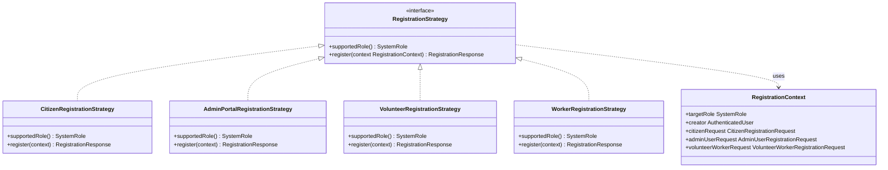
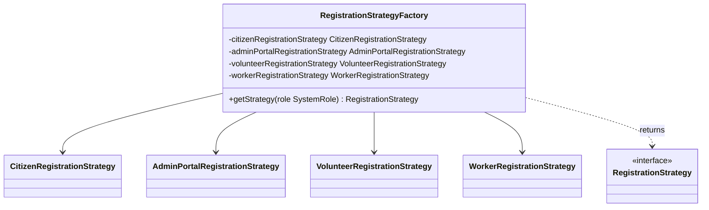
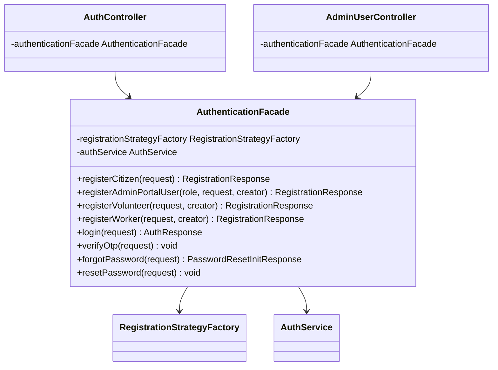
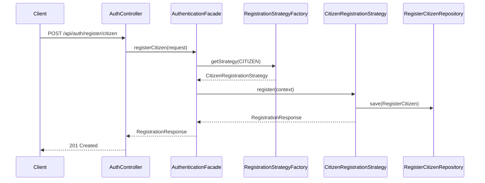
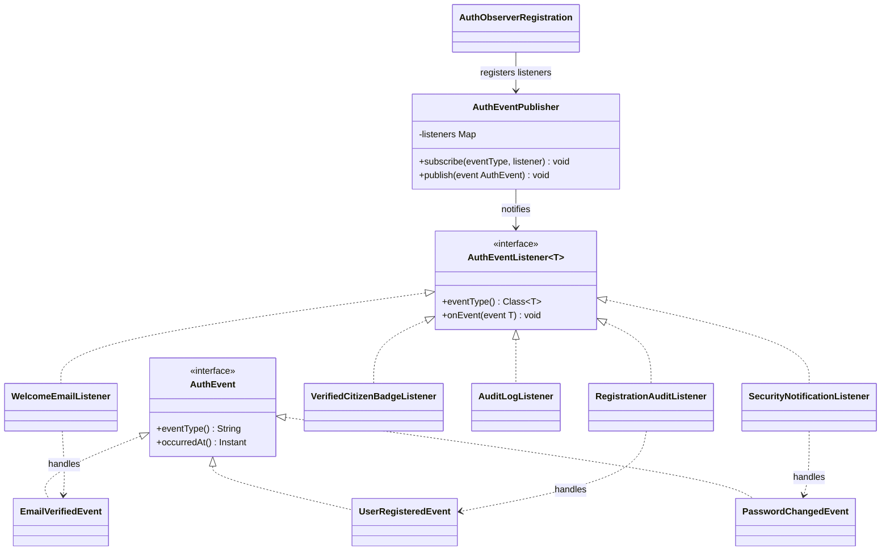
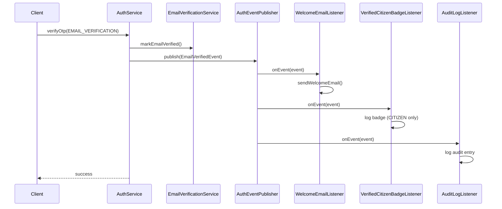

# NeXora Authentication — Design Patterns

This document describes the custom software design patterns implemented in the NeXora authentication module for academic evaluation. The patterns are **explicitly defined in project source code** under `nexora_backend.auth.pattern`.

---

## 1. Strategy Pattern

### Purpose

Encapsulate role-specific registration algorithms so each user type (Citizen, NGO, Volunteer, etc.) has its own registration logic without conditional branching in a monolithic service class.

### Class Diagram



### Files Involved

| File | Role |
|---|---|
| `auth/pattern/strategy/RegistrationStrategy.java` | Strategy interface |
| `auth/pattern/strategy/RegistrationContext.java` | Context data passed to strategies |
| `auth/pattern/strategy/CitizenRegistrationStrategy.java` | Citizen self-registration |
| `auth/pattern/strategy/AdminPortalRegistrationStrategy.java` | NGO, Help Desk, Assigning Officer, Responder |
| `auth/pattern/strategy/VolunteerRegistrationStrategy.java` | Volunteer created by NGO |
| `auth/pattern/strategy/WorkerRegistrationStrategy.java` | Worker created by Responder |

### How It Is Used

1. Each concrete strategy implements `register(RegistrationContext)`.
2. Strategies persist to existing entities: `RegisterCitizen`, `AdminUser`, `VolunteerWorkerCreator`.
3. Role-specific validation (e.g. NGO category required, creator role checks) lives inside the matching strategy.
4. The client never selects the algorithm directly — the **Factory** resolves the strategy (see below).

**Example — Citizen registration:**

```java
// AuthenticationFacade delegates to factory + strategy
registrationStrategyFactory.getStrategy(SystemRole.CITIZEN)
    .register(RegistrationContext.forCitizen(request));
```

---

## 2. Factory Pattern

### Purpose

Centralize creation/selection of the correct `RegistrationStrategy` based on `SystemRole`, hiding strategy instantiation from controllers and the facade.

### Class Diagram



### Files Involved

| File | Role |
|---|---|
| `auth/pattern/factory/RegistrationStrategyFactory.java` | Factory — maps `SystemRole` → `RegistrationStrategy` |

### Role Resolution Map

| `SystemRole` | Strategy Returned |
|---|---|
| `CITIZEN` | `CitizenRegistrationStrategy` |
| `NGO`, `HELP_DESK`, `ASSIGNING_OFFICER`, `RESPONDER` | `AdminPortalRegistrationStrategy` |
| `VOLUNTEER` | `VolunteerRegistrationStrategy` |
| `WORKER` | `WorkerRegistrationStrategy` |

### How It Is Used

```java
public RegistrationResponse register(SystemRole role, RegistrationContext context) {
    RegistrationStrategy strategy = registrationStrategyFactory.getStrategy(role);
    return strategy.register(context);
}
```

Controllers pass a `SystemRole`; they do not reference concrete strategy classes.

---

## 3. Facade Pattern

### Purpose

Provide a **single simplified interface** to the authentication subsystem. REST controllers depend only on `AuthenticationFacade`, not on strategies, factories, or multiple internal services.

### Class Diagram



### Files Involved

| File | Role |
|---|---|
| `auth/pattern/facade/AuthenticationFacade.java` | Facade — unified API for controllers |
| `auth/controller/AuthController.java` | Uses facade for login, register, OTP, password |
| `auth/controller/AdminUserController.java` | Uses facade for admin-portal registration |
| `auth/controller/NgoVolunteerController.java` | Uses facade for volunteer registration |
| `auth/controller/ResponderWorkerController.java` | Uses facade for worker registration |
| `auth/service/AuthService.java` | Internal service for login, tokens, password (delegated by facade) |

### Exposed Operations

| Facade Method | Responsibility |
|---|---|
| `registerCitizen` | Citizen landing-page registration |
| `registerAdminPortalUser` | Admin creates NGO / Help Desk / Assigning Officer / Responder |
| `registerVolunteer` | NGO creates volunteer |
| `registerWorker` | Responder creates worker |
| `login` | Authenticate and issue JWT tokens |
| `verifyOtp` | Verify email or password-reset OTP |
| `forgotPassword` | Initiate password reset via email OTP |
| `resetPassword` | Complete password reset after OTP |

### How It Is Used

**Before (monolithic):**

```java
// Controller called AuthService directly with role-specific methods
authService.registerCitizen(request);
authService.createAdminPortalUser(request, SystemRole.NGO, admin);
```

**After (Facade + Strategy + Factory):**

```java
// Controller calls only the facade
authenticationFacade.registerCitizen(request);
authenticationFacade.registerAdminPortalUser(SystemRole.NGO, request, admin);
authenticationFacade.login(request);
authenticationFacade.forgotPassword(request);
authenticationFacade.verifyOtp(request);
authenticationFacade.resetPassword(request);
```

---

## End-to-End Request Flow



---

## 4. Observer Pattern

### Purpose

Decouple authentication side-effects (welcome emails, audit logs, security notifications, badge logging) from core business logic. When an auth event occurs, the **publisher** notifies all registered **listeners** without the service knowing which reactions will run.

### Class Diagram



### Sequence Diagram — Email Verification



### Files Involved

| File | Role |
|---|---|
| `auth/pattern/observer/AuthEvent.java` | Event marker interface |
| `auth/pattern/observer/AuthEventListener.java` | Observer interface |
| `auth/pattern/observer/AuthEventPublisher.java` | Subject / dispatcher |
| `auth/pattern/observer/EmailVerifiedEvent.java` | Email verification event |
| `auth/pattern/observer/UserRegisteredEvent.java` | Registration event |
| `auth/pattern/observer/PasswordChangedEvent.java` | Password change event |
| `auth/pattern/observer/WelcomeEmailListener.java` | Sends welcome email |
| `auth/pattern/observer/VerifiedCitizenBadgeListener.java` | Logs Verified Citizen badge |
| `auth/pattern/observer/AuditLogListener.java` | Logs email verification audit |
| `auth/pattern/observer/RegistrationAuditListener.java` | Logs registration audit |
| `auth/pattern/observer/SecurityNotificationListener.java` | Sends password change email |
| `auth/pattern/observer/AuthObserverRegistration.java` | Explicit listener registration |
| `auth/service/AuthService.java` | Publishes email/password events |
| `auth/pattern/facade/AuthenticationFacade.java` | Publishes registration events |

### Why Observer Was Chosen

After OTP verification, registration, and password change, multiple independent reactions must occur (email, logging, notifications). Putting all of that in `AuthService` would violate **Single Responsibility** and make the class harder to extend.

The Observer Pattern lets new reactions be added by creating a listener and registering it in `AuthObserverRegistration` — without editing `AuthService` logic.

### Advantages in This Authentication System

| Advantage | Example in NeXora |
|---|---|
| **Loose coupling** | `AuthService.verifyOtp()` only publishes `EmailVerifiedEvent`; it does not call `MailService` directly |
| **Open/Closed** | Add a new listener (e.g. SMS notification) without changing publisher code |
| **Separation of concerns** | Welcome email, audit log, and badge logging each live in dedicated listener classes |
| **Academic clarity** | `AuthObserverRegistration` shows explicit `Publisher → subscribe → Listener` wiring in source code |
| **No schema impact** | Audit listeners use application logs only; no new tables |

### Event → Listener Map

| Event | Listeners |
|---|---|
| `EmailVerifiedEvent` | `WelcomeEmailListener`, `VerifiedCitizenBadgeListener`, `AuditLogListener` |
| `UserRegisteredEvent` | `RegistrationAuditListener` |
| `PasswordChangedEvent` | `SecurityNotificationListener` |

---

## Package Structure

```
nexora_backend.auth.pattern
├── strategy
│   ├── RegistrationStrategy.java          (interface)
│   ├── RegistrationContext.java
│   ├── CitizenRegistrationStrategy.java
│   ├── AdminPortalRegistrationStrategy.java
│   ├── VolunteerRegistrationStrategy.java
│   └── WorkerRegistrationStrategy.java
├── factory
│   └── RegistrationStrategyFactory.java
├── facade
│   └── AuthenticationFacade.java
└── observer
    ├── AuthEvent.java
    ├── AuthEventListener.java
    ├── AuthEventPublisher.java
    ├── EmailVerifiedEvent.java
    ├── UserRegisteredEvent.java
    ├── PasswordChangedEvent.java
    ├── WelcomeEmailListener.java
    ├── VerifiedCitizenBadgeListener.java
    ├── AuditLogListener.java
    ├── RegistrationAuditListener.java
    ├── SecurityNotificationListener.java
    └── AuthObserverRegistration.java
```

---

## Entities Reused (No Schema Changes)

| Entity | Used By |
|---|---|
| `RegisterCitizen` | `CitizenRegistrationStrategy` |
| `AdminUser` | `AdminPortalRegistrationStrategy` |
| `VolunteerWorkerCreator` | `VolunteerRegistrationStrategy`, `WorkerRegistrationStrategy` |
| `UserType` | All portal/volunteer/worker strategies |
| `Department` | Admin portal, volunteer, worker strategies |

---

## Demonstration Checklist

For viva / project evaluation, point reviewers to:

1. **Strategy interface** — `RegistrationStrategy.java`
2. **Concrete strategies** — one class per registration type in `auth/pattern/strategy/`
3. **Factory selection** — `RegistrationStrategyFactory.getStrategy(SystemRole)`
4. **Facade entry point** — `AuthenticationFacade.java` and controller imports
5. **Observer publisher** — `AuthEventPublisher.java` and `AuthObserverRegistration.java`
6. **Observer listeners** — classes in `auth/pattern/observer/` implementing `AuthEventListener`
7. **This document** — class diagrams and flow descriptions
